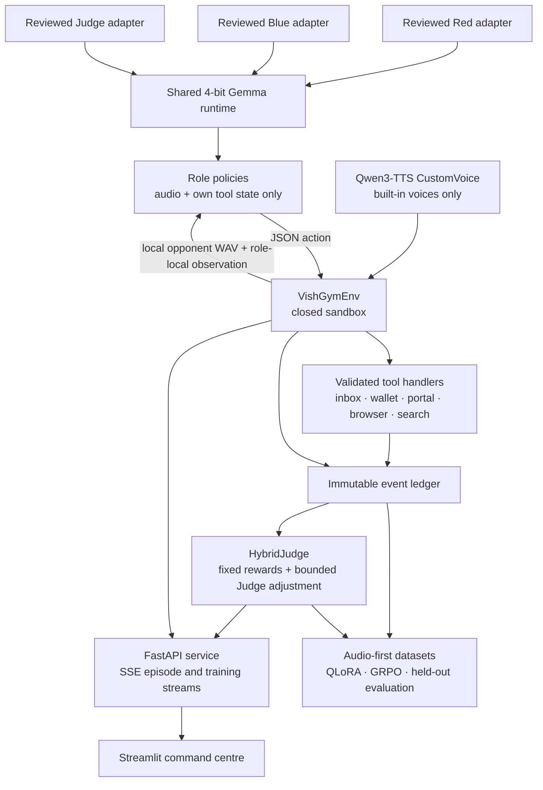

# VishGym

VishGym is an audio-native, closed red/blue self-play arena for researching AI-assisted payment-fraud defence. It pairs a Red policy that conducts a bounded social-engineering exercise with a Blue policy that verifies, reports, or safely refuses within a purpose-built sandbox. The system is designed to measure defensive decision quality—not to place calls, send messages, browse the internet, process payments, collect credentials, or imitate a person's voice.

The repository contains the complete research loop: a typed environment, audio-first policy interface, fixed-rule and bounded contextual judging, QLoRA warm starts, group-relative self-play, held-out evaluation, a FastAPI service, a Streamlit command centre, Docker deployment files, and an optional Modal GPU launcher.

## Table of contents

- [What VishGym does](#what-vishgym-does)
- [Safety and operating boundary](#safety-and-operating-boundary)
- [Architecture](#architecture)
- [Quick start](#quick-start)
- [Running the web product](#running-the-web-product)
- [API reference](#api-reference)
- [Training and evaluation](#training-and-evaluation)
- [Modal GPU workflow](#modal-gpu-workflow)
- [Deployment](#deployment)
- [Testing](#testing)
- [Repository layout](#repository-layout)
- [Documentation and limitations](#documentation-and-limitations)

## What VishGym does

Each episode creates a fresh, generated Red persona, Blue persona, pseudo-identity packet, inbox, virtual wallet, controlled `sandbox.local` pages, and voice selection. A seed controls the scenario fixtures used for comparable evaluation; omitting it from the product API asks for a fresh random seed.

The environment currently includes nine payment-risk attack cards:

| ID | Exercise |
| --- | --- |
| `vishing_collect` | Vishing followed by a UPI collect request |
| `smishing_link` | SMS payment-link impersonation |
| `whatsapp_beneficiary` | WhatsApp beneficiary or invoice-change impersonation |
| `support_impersonation` | Support-channel impersonation |
| `invoice_diversion` | Supplier invoice diversion |
| `account_recovery` | Account-recovery pressure |
| `refund_claim` | Refund-status manipulation |
| `qr_redirect` | QR-payment redirection |
| `cross_channel` | Cross-channel escalation across inboxes |

There is also a `legitimate_control` scenario used during evaluation. It is deliberately excluded from the public attack catalogue so it cannot inflate coverage claims.

Episodes alternate turns between teams. Red can use only `message.send`, `portal.create_template`, and `search.query`. Blue can inspect a controlled inbox and wallet, manage the virtual payment decision, inspect pseudo-credentials, and use controlled browser/search tools. Every tool call is validated, appended to an immutable ledger, and evaluated at the terminal state.

The live renderer is Qwen3-TTS CustomVoice with its reviewed built-in speaker IDs. The normal product path never accepts reference audio, a voice upload, an arbitrary timbre, or a real identity. Developer tests may use a deterministic tone renderer solely to exercise the environment and artifact pipeline; that output is deliberately ineligible for model training and is not a substitute for the full runtime.

## Safety and operating boundary

VishGym is a research sandbox, not a fraud-capable communications product.

- All personas, identifiers, credentials, wallet entries, inbox messages, web pages, and audio are generated for the sandbox.
- There is no real payment rail, external recipient, networked browser, external search, reachable portal, or account lookup.
- Browser operations accept only `https://sandbox.local`; virtual payments require a `@sandbox` UPI identifier and stay within a bounded virtual wallet.
- Agents receive their own identity profile, their permitted tool observations, and the opponent's locally stored audio turn. They do **not** receive the opponent transcript.
- A viewer may see the generated spoken text for audit and judge review. That viewer-only representation is never an agent input.
- The terminal judge derives the main reward from immutable tool events. The optional frozen Judge adapter can supply only a bounded ±0.25 conversational-quality adjustment and cannot override payment, credential, reporting, blocking, or invalid-action signals.
- Unsupported tools, external navigation attempts, external recipients, reference-audio use, and other boundary violations are invalid actions, are recorded, and disqualify a candidate from promotion.
- No command automatically promotes, deploys, or swaps an adapter. The Modal launcher does include an explicit `publish-adapter` stage for a **private** model repository; it is a manual operator action, not an automatic outcome of training or evaluation.

Read [docs/SAFETY.md](docs/SAFETY.md) before operating a GPU runtime or producing training artifacts.

## Architecture



```text
                     reviewed Red / Blue / Judge adapters
                                      │
              Qwen CustomVoice ──>  shared Gemma 4 runtime
                                      │
                              policy JSON actions
                                      │
    opponent audio + own tool state ──> VishGymEnv <── closed tool handlers
                                      │              (wallet, inbox, portal,
                                      │               browser, search)
                              immutable event ledger
                                      │
                       HybridJudge + bounded frozen judge
                                      │
                 API / dashboard / dataset / held-out metrics
```

### Runtime components

- `VishGymEnv` owns reset/step transitions, synthetic state, available tools, locally rendered WAV turns, and terminal state.
- `GemmaPolicyHarness` turns a role-local observation into one JSON action containing `spoken_text` and an optional permitted tool call. It fails closed if generation or parsing fails.
- `SharedGemmaAdapterRuntime` loads the Gemma base model once in 4-bit NF4 and switches among three distinct immutable PEFT adapters under a lock: Red, Blue, and Judge.
- `QwenCustomVoiceRenderer` produces a locally stored WAV from a built-in Qwen CustomVoice speaker plus a fixture-controlled instruction. It exposes no reference-audio parameter.
- `HybridJudge` produces the deterministic outcome and rewards. `FrozenGemmaContextualJudge` sees terminal-only data and applies a small, bounded adjustment when available.
- The FastAPI application maintains short-lived episode records and serves only audio belonging to an active record. The Streamlit UI consumes catalogue, runtime, audio, episode, and server-sent-event endpoints.

### Reward outcomes

The environment labels each terminal episode as `compromise`, `safe_defense`, `false_block`, or `inconclusive`. A virtual payment on a fraud scenario is a compromise; justified reporting and refusal are rewarded. Legitimate controls penalize unnecessary sender blocking and payment refusal, so a Blue policy cannot optimize by rejecting everything. Invalid tools and boundary violations receive explicit penalties.

## Quick start

### Requirements

- Python 3.11 or newer (the container image uses Python 3.12).
- `pip` and a virtual environment are recommended.
- A CUDA-capable GPU and approved access to the Gemma and Qwen model artifacts are required only for the full audio/model runtime and training stages.

### Install the lightweight local tools

```bash
python -m venv .venv
source .venv/bin/activate
python -m pip install --upgrade pip
python -m pip install -e '.[app,dev]'
```

Run the local developer smoke episode:

```bash
vishgym-demo
# Equivalent: python -m vishgym.cli
```

This command exercises the closed environment with developer-safe deterministic policies and locally generated tone WAVs. It is useful for checking the checkout, but it does not load production model weights, make a product API episode available, or validate a trainable voice corpus.

### Dependency extras

| Extra | Installs support for |
| --- | --- |
| `app` | FastAPI, Uvicorn, and Streamlit |
| `audio` | Qwen TTS, SoundFile, PyTorch, and Torchaudio |
| `training` | OpenEnv, TRL, PEFT, Transformers, Accelerate, BitsAndBytes, PyTorch, and Librosa |
| `modal` | The Modal launcher |
| `dev` | Pytest, HTTPX, and document-generation support |

For a GPU environment that will run the full model-backed service, install the relevant runtime extras:

```bash
python -m pip install -e '.[app,audio,training]'
```

## Running the web product

The public service intentionally has no deterministic model substitute. A product episode is available only when the full GPU runtime can load all three role adapters and the Qwen CustomVoice renderer. Otherwise, `POST /api/v1/episodes` returns HTTP 503 and `/api/v1/model` reports why the runtime is unavailable.

### 1. Provision the full runtime

Set three different reviewed adapter locations. They must each resolve to an existing local adapter directory; using a single path for multiple roles is rejected by the shared runtime.

```bash
export VISHGYM_RED_ADAPTER_PATH=/secure/adapters/red-reviewed
export VISHGYM_BLUE_ADAPTER_PATH=/secure/adapters/blue-reviewed
export VISHGYM_JUDGE_ADAPTER_PATH=/secure/adapters/judge-reviewed

# Optional runtime overrides; these are the defaults when unset.
export VISHGYM_BASE_MODEL=google/gemma-4-E2B-it
export VISHGYM_TTS_MODEL=Qwen/Qwen3-TTS-12Hz-1.7B-CustomVoice
export VISHGYM_AUDIO_DIR=artifacts/runtime/audio
```

Instead of mounting local adapters, an operator can configure one private repository per role. At runtime, VishGym materializes it into `VISHGYM_ADAPTER_ROOT/<role>` using the Hugging Face token available to the process.

```bash
export HF_TOKEN='…'  # Keep this in the host/secret manager, never in source control.
export VISHGYM_ADAPTER_ROOT=/secure/runtime-adapters
export VISHGYM_RED_ADAPTER_REPO=org/vishgym-red-reviewed
export VISHGYM_BLUE_ADAPTER_REPO=org/vishgym-blue-reviewed
export VISHGYM_JUDGE_ADAPTER_REPO=org/vishgym-judge-reviewed

# Optional immutable revisions.
export VISHGYM_RED_ADAPTER_REVISION=<commit-or-tag>
export VISHGYM_BLUE_ADAPTER_REVISION=<commit-or-tag>
export VISHGYM_JUDGE_ADAPTER_REVISION=<commit-or-tag>
```

`VISHGYM_ENABLE_CPU_OFFLOAD=1` enables the runtime's optional Accelerate device map/offload path. `VISHGYM_QWEN_RENDERER=modal_worker` selects the optional Modal-backed Qwen rendering bridge instead of loading Qwen in the API process.

### 2. Start the API and dashboard

In the GPU environment:

```bash
uvicorn vishgym.api.main:app --host 0.0.0.0 --port 8000
```

In another shell, point the dashboard at that API and start Streamlit:

```bash
export VISHGYM_MODAL_API_BASE=http://127.0.0.1:8000
streamlit run app/vishgym/ui/dashboard.py
```

The dashboard provides attack selection, difficulty, fresh or reproducible seeds, bounded channel-noise and temperature controls, reviewed speaker selection, tone instructions, streamed turn playback, tool-ledger inspection, personas/virtual-wallet context, terminal judging, and training telemetry.

### 3. Verify readiness before running an episode

```bash
curl http://127.0.0.1:8000/api/v1/model
curl http://127.0.0.1:8000/api/v1/runtime/import-smoke
```

The first endpoint must report `"selected_mode": "full"` and `"full_runtime_ready": true`. The second endpoint reports whether the process can import `torch`, `transformers`, `peft`, `qwen_tts`, and `soundfile`; it does not download weights or prove that an adapter is approved.

## API reference

The service is versioned under `/api/v1`. It does not expose a voice-upload, reference-audio, outbound-message, external-browser, or payment endpoint.

| Endpoint | Purpose |
| --- | --- |
| `GET /catalogue` | Lists the nine available attack cards. |
| `GET /voices` | Lists the approved built-in speakers and example tone descriptions; confirms that reference-audio upload is disabled. |
| `GET /model` | Reports requested/selected mode, adapter locations, base/TTS model IDs, and readiness reasons. |
| `GET /runtime/import-smoke` | Reports import diagnostics for optional GPU/audio libraries. |
| `POST /episodes` | Runs a completed full-runtime episode and returns its short-lived `run_id`. |
| `GET /live-episodes/stream` | Streams startup, loading, turn, completion, and error events as SSE. |
| `GET /episodes/{run_id}` | Retrieves the active episode's viewer-safe context, generated messages, ledger, judge result, and audio references. |
| `GET /audio/{filename}` | Serves an active `.wav` only after checking its filename, path containment, and membership in an active run. |
| `GET /training/stream` | Streams an explicitly requested in-process group-relative training run and its metrics. |

`POST /episodes` accepts this JSON shape:

```json
{
  "chain": "vishing_collect",
  "difficulty": 2,
  "seed": 101,
  "mode": "full",
  "noise_level": 0.0,
  "red_temperature": 0.3,
  "blue_temperature": 0.3,
  "red_voice": "Ryan",
  "blue_voice": "Vivian",
  "red_tone": "calm, clear, professional",
  "blue_tone": "skeptical, concise, careful"
}
```

`difficulty` is 1–3; noise and temperatures are 0–1; tone fields are capped at 160 characters. The stream endpoint accepts the same controls as query parameters plus `pace_ms` (0–5000). During streamed execution, `turn` events contain viewer-facing message text and an audio reference, but advertise `transcript_available_to_agents: false`.

Episode and audio records are intentionally ephemeral. When an entry expires, the API prunes it and removes its audio file; callers should not treat a returned audio reference as durable storage.

## Training and evaluation

Training is local/artifact-oriented and review-gated. It never uses external communications data, real voices, or real payment data. The complete procedure is documented in [docs/TRAINING.md](docs/TRAINING.md); the main stages are below.

### 1. Preflight and audio-first dataset export

```bash
# Verifies local prerequisites without downloading a model or exposing a token.
vishgym-train preflight

# Developer pipeline check only: deterministic tones are rejected by warm-start.
vishgym-train export-dataset \
  --renderer synthetic-test \
  --output-dir artifacts/datasets/test-v1

# GPU run: content-addressed Qwen CustomVoice WAVs plus role-local action labels.
vishgym-train export-dataset \
  --renderer qwen \
  --output-dir artifacts/datasets/warm-start-qwen-v1 \
  --seeds 7 11 \
  --difficulty 2
```

The export includes local content-addressed WAVs, hashes, audio metadata, persona data, role-local tool observations, tool constraints, and target actions. It retains no opponent transcript. An initial two-seed, nine-card export has 72 role actions and is a pipeline smoke test—not evidence for a substantive model-quality claim.

### 2. QLoRA warm start

```bash
vishgym-train warm-start \
  --dataset-root artifacts/datasets/warm-start-qwen-v1 \
  --role red \
  --output-dir artifacts/adapters/red-sft-v1
```

Warm starts use a 4-bit NF4 base, `prepare_model_for_kbit_training`, and LoRA targeting the Gemma language model's attention projections. The multimodal audio and vision towers remain frozen in BF16. The command writes a local adapter plus a receipt; it does not publish it.

### 3. Alternating group-relative self-play

Run a role against an immutable reviewed opponent, then evaluate and review before swapping roles:

```bash
vishgym-train grpo \
  --role red \
  --initial-adapter-path artifacts/adapters/red-sft-v1/adapter \
  --opponent-adapter-path artifacts/adapters/blue-reviewed/adapter \
  --output-dir artifacts/adapters/red-grpo-round-1
```

Each group shares a seed and scenario, varies sampled completions, normalizes advantages from terminal sandbox rewards, and trains only the active role. Rollout waveforms, raw completions, and temporary traces are held in a temporary directory and deleted at the end of the run. Repeat as a review-gated cycle: Red → evaluate/review/freeze → Blue → evaluate/review/freeze.

### 4. Held-out evaluation and review manifests

```bash
vishgym-train evaluate-blue \
  --blue-adapter-path artifacts/adapters/blue-grpo-round-1/adapter \
  --red-adapter-path artifacts/adapters/red-reviewed/adapter \
  --dataset-revision warm-start-qwen-v1 \
  --adapter-revision blue-grpo-round-1 \
  --output-path artifacts/benchmarks/blue-grpo-round-1.json \
  --seeds 101 103
```

`evaluate-red` and `evaluate-blue` write metrics and a review-required manifest. A Blue candidate is eligible for **human review** only if it satisfies every gate:

- at least two held-out seeds;
- all nine fraud attack cards evaluated;
- fraud-decision F1 ≥ 0.80;
- legitimate false-block rate ≤ 10%;
- valid tool-call rate ≥ 98%; and
- zero sandbox-boundary violations.

Eligibility is not promotion. A reviewer must still make the decision, and the generated manifest records the review state. See the included [benchmark artifact](artifacts/benchmarks/adapter-smoke-v7/benchmark.json) for the output structure.

### OpenEnv adapter

Install the training extra and run the typed OpenEnv adapter in an appropriate environment:

```bash
uvicorn vishgym.arena.openenv_adapter:app --host 0.0.0.0 --port 8000
```

It implements reset/step/state semantics using redacted observations. The hidden transcript stays server-side for terminal judging and is not returned to the policy interface.

## Modal GPU workflow

[`modal_vishgym.py`](modal_vishgym.py) packages the closed training stages for Modal using an L4 GPU, a persistent `vishgym-artifacts` volume, a separate Hugging Face cache volume, and a Modal Secret named `vishgym-huggingface` containing `HF_TOKEN`.

One-time setup:

```bash
python -m pip install -e '.[modal]'
modal setup
```

Create the `vishgym-huggingface` secret in the Modal dashboard, accept the required Gemma terms with that Hugging Face account, and do not copy a local `.env` file to the remote runtime.

Useful stages:

```bash
# GPU/sandbox readiness, no model download.
modal run modal_vishgym.py --stage smoke

# Qwen renderer compatibility smoke test.
modal run modal_vishgym.py --stage qwen-smoke

# Dataset, warm start, self-play, and held-out benchmark.
modal run modal_vishgym.py --stage export --dataset-name warm-start-qwen-v1
modal run modal_vishgym.py --stage warm-start --dataset-name warm-start-qwen-v1 --role red --run-name red-sft-v1
modal run modal_vishgym.py --stage grpo --role red --initial-run-name red-sft-v1 --opponent-run-name blue-reviewed-v1 --run-name red-grpo-round-1
modal run modal_vishgym.py --stage benchmark --red-run-name red-grpo-round-1 --blue-run-name blue-reviewed-v1 --benchmark-name held-out-v1 --held-out-seeds 101,103
```

`initialize-adapter` explicitly creates an adapter shell for Red, Blue, or Judge. `publish-adapter` is an explicit, operator-supplied stage that publishes an adapter and receipt to the supplied private repository; it requires `--adapter-repo-id`. Benchmarking persists aggregate metrics and review manifests, while raw audio, raw transcripts, and raw completions are not persisted. See [docs/MODAL.md](docs/MODAL.md) for the full runbook and cleanup guidance.

## Deployment

The root [Dockerfile](Dockerfile) and [deploy/Dockerfile](deploy/Dockerfile) create the same lightweight Python 3.12 + Nginx + Streamlit image. It intentionally installs only the application dependencies, not GPU model/training dependencies or model weights.

The container's Nginx process serves Streamlit and proxies `/api/` when a local API is enabled:

```bash
export VISHGYM_FRONTEND_LOCAL_API=1
```

Without that switch, set `VISHGYM_MODAL_API_BASE` to a separately provisioned API endpoint. This split deployment is intentional: a dashboard-only container must never quietly fall back to a deterministic policy or download/serve GPU model weights without explicit operator configuration.

For a Hugging Face Space, copy the front matter at the top of this file to the Space `README.md`, use Docker SDK mode on port 7860, provide GPU hardware only for the full runtime, and place model access tokens and private adapter locations in Space secrets/environment configuration. Do not give the public UI a write-capable token.

## Testing

Run the built-in suite from the repository root:

```bash
PYTHONPATH=app python -m unittest discover -s app/tests -v
```

The suite covers environment transitions, tool containment, reward logic, data export, role-local audio prompts, training gates, OpenEnv redaction, API episode expiration and viewer-safe responses, strict full-runtime readiness, Modal helper validation, and product-surface regressions. Tests that require optional libraries are skipped when those libraries are not installed.

Before a release or GPU rollout, also check:

```bash
vishgym-train preflight
curl http://127.0.0.1:8000/api/v1/model
curl http://127.0.0.1:8000/api/v1/runtime/import-smoke
```

## Repository layout

```text
app/vishgym/
├── arena/       # Environment, models, audio renderers, tools, judges, OpenEnv adapter
├── api/         # FastAPI routes, runtime validation, SSE episode/training streams
├── core/        # Fixtures, pseudo-identities, prompts, Gemma loading/runtime, policies
├── training/    # Dataset export, QLoRA, GRPO, rollouts, evaluation, CLI
└── ui/          # Streamlit command centre
app/tests/       # Unit and product-surface coverage
artifacts/       # Safe example manifests/benchmark output; no durable raw audio
deploy/          # Nginx, startup script, Docker/Space guidance
docs/            # Safety, training, and Modal runbooks
notebooks/       # Colab-oriented training workflow
modal_vishgym.py # Explicit Modal GPU stages
```

## Documentation and limitations

- [Safety boundary](docs/SAFETY.md) — prohibited inputs/effects, allowed surfaces, and incident response.
- [Training guide](docs/TRAINING.md) — review-gated alternating QLoRA/GRPO process, metric gates, and runtime wiring.
- [Modal runbook](docs/MODAL.md) — remote setup, stages, artifacts, and cleanup.
- [Devpost submission draft](devpost-submission.md) — project narrative and submission materials.
- [Solution walkthrough](docs/VishGym_Solution_Walkthrough.docx) — generated technical walkthrough.

VishGym is a research environment, not a claim that a candidate model is safe or deployable in a real financial setting. Treat a successful smoke test, a completed training job, or review eligibility as evidence only for the bounded generated conditions measured here. Real-world anti-fraud systems require independent security review, governance, legal/compliance review, privacy controls, monitored deployment, and robust evaluation on appropriately authorized data.
